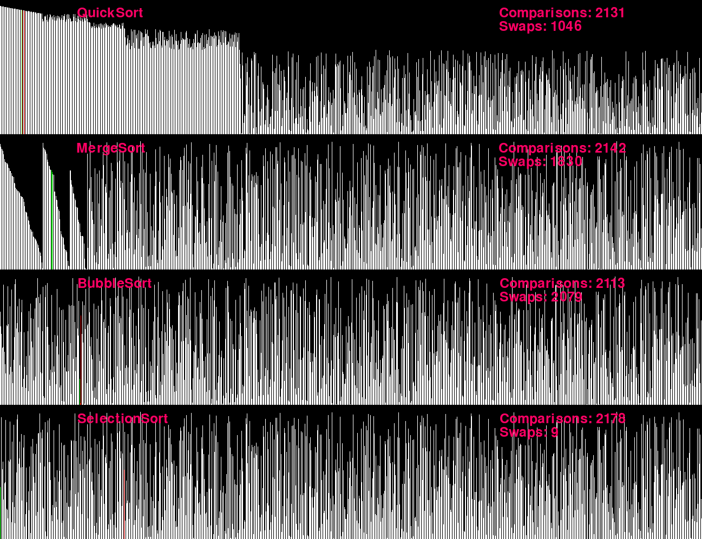

# SortSorter

> This script was inspired by those satisfying videos that compare different sorting algorithms, but it allows you to easily create, test and compare your own.
A shuffled list of numbers, represented by bars of different lengths, is sorted by each algorithm simuntaniously and in real time. The number of comparisons and item swaps is shown for each one.



## Usage

* To run the program, make sure to have python 3.8 or higher and pygame installed. Run the program with the command 'python3 main.py'.
```
pip install pygame
python3 main.py
```
* Selection Sort, Merge Sort, Quick Sort and Bubble Sort are already implemented (optimizing them should be fun!)

## Build your own algorithm
1) Create a new .py file inside the ./algorithms folder. Use "Template.py" as a guide.
* Make sure to use exclusively the provided methods for comparing and swapping items. Use the list index methods when possible
* Avoid auxiliary lists to maintain visual consistancy and for an additional challenge.
2) Include the new algorithm name in the "config.txt" file, in the "algorithmsList" field.

## Config file

1) "width" and "heigh": screen dimensions in pixels.
2) "listLength": size of the list to be sorted. Can't be larger than the screen width.
3) "comparisonsPerSecond": controls the duration of the artificial delay in comparisons.
4) "listType": Determines the type of list to be sorted. Changes the expected cost of some algorithms
* "reversed" : list sorted in the reverse order 
* "shuffled": list shuffled
5) "algorithmsList": list of algorithms in the ./algorithms folder to be executed.

 Created by [Victor Hugo Cercasin](https://github.com/VictorCercasin/SortSorter)
 Project's [GitHub](https://github.com/VictorCercasin/) page
